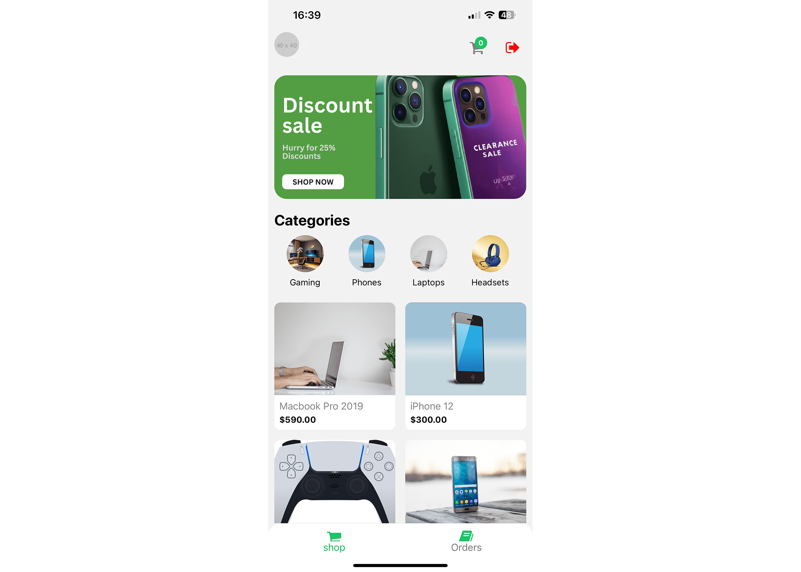

# 📱 Ultimate Gadgets Mobile App

Welcome to the **Ultimate Gadgets Mobile App** — a complete cross-platform solution for buying and browsing gadgets!  
Built with **React Native**, **Expo**, **Zustand**, and **Supabase**.

---

### 🛍️ Mobile App (React Native)

- **Home Screen**
  
  

---

## ⚙️ Tech Stack

| Layer           | Technology               |
|-----------------|--------------------------|
| Mobile App      | React Native (Expo)      |
| State Management| Zustand                  |
| Backend         | Supabase (PostgreSQL)    |
| Environment     | `.env.local`             |

---

## 📋 Prerequisites

Make sure you have the following installed:

- ✅ Node.js (v14 or higher)
- ✅ npm (latest version)
- ✅ Expo CLI
- ✅ Git

---

## 🚀 Getting Started

### 1️⃣ Clone the Repository

```bash
git clone https://github.com/OshanaKavishan/gadgets-app-react-native.git
cd gadgets-app-react-native
```
### 2️⃣ Install Dependencies

```bash
npm install
```
### 3️⃣ Set Up Environment Variables
Rename the .env.example file to .env.local and add your Supabase credentials:

```bash
mv .env.example .env.local
```
Edit .env.local to match your backend setup (refer to .env.example for guidance).

### 4️⃣ Run the App
Start the development server:

```bash
npm start
```
Then, launch the app using your preferred emulator or Expo Go on your device.

## 🔐 Environment Variables
Make sure to configure the following (inside .env.local):

```bash
SUPABASE_URL=your-supabase-project-url
SUPABASE_ANON_KEY=your-supabase-anon-key
```
You can find these keys in your Supabase project settings.

## 🤝 Contributions
Contributions, issues, and feature requests are welcome! Feel free to connect. ✨

## 🎥 Watch the Full Course Video
If you want to deepen your understanding or explore a step-by-step guide related to this project, check out this helpful YouTube playlist:

👉 [Fullstack Gadgets App: React Native Expo & Next.js Admin](https://youtu.be/26opRFPU0a8)

## 🤝 Let's Work Together

I'm Oshana Kavishan — passionate about building modern web and mobile applications.  
If you're interested in working together or just want to connect, feel free to reach out!

- 📧 Email: kavishansilva@gmail.com  
- 🔗 LinkedIn: [linkedin.com/in/oshana-kavishan-9ab10b23b](https://www.linkedin.com/in/oshana-kavishan-9ab10b23b)  
- 💻 GitHub: [github.com/OshanaKavishan](https://github.com/OshanaKavishan)
